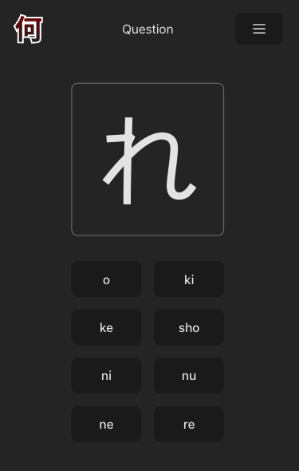

I built this project for my adult Japanese class to help me learn hiragana and katakana, and also to get some basic experience with Vue. It's deployed to GitHub Pages.

My initial impression of Vue was _okay_? I didn't see any reason to switch from

[Nani Kana](https://cwparsons.ca/nani-kana/)

[Check out the repository on GitHub](https://github.com/cwparsons/nani-kana).
