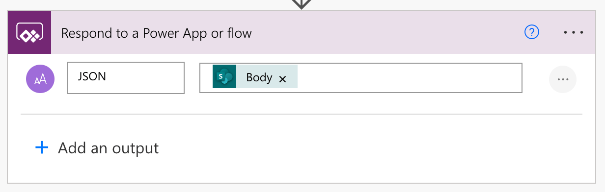

## Error handling

Every external call should be wrapped with `IfError`, along with `Notify` to show error messaging.

```powerquery
IfError(
    Set(
        gblDocument,
        LookUp(
            'Document Library',
            And(
                'Document Id' = Value(fxUrlParameters.ListItemId),
                'Document revision' = gblDocumentRevision
            )
        )
    ),
    // On failure
    Notify(
        $"Sorry, something went wrong trying to get document data. Please try again.",
        NotificationType.Error
    );
    Notify(
        FirstError.Message,
        NotificationType.Error
    ),
    // On success
    ...
);
```

## Getting content through Microsoft Graph

If you can't connect to a SharePoint list or library due to the max lookup column issue, it is possible to retrieve content using the Graph Call.

With the Office 365 Groups connector, the following query can get a list item from a SharePoint list:

```powerquery
IfError(
    With(
        {
            varDocument: Office365Groups.HttpRequest(
                $"https://graph.microsoft.com/v1.0/sites/{fxUrlParameters.SiteId}/lists/{fxUrlParameters.ListId}/items/{fxUrlParameters.ListItemId}",
                "GET",
                ""
            )
        },
        UpdateContext({
            locDocumentTitle: Text(varDocument.fields.Title)
        });
    ),
    // On failure
    Notify(
        $"Sorry, something went wrong trying to get document metadata. Please try again.",
        NotificationType.Error
    );
    Notify(
        FirstError.Message,
        NotificationType.Error
    ),
    // On success
    ...
);
```

## People picker using a combo box

## Parsing JSON from a Power Automate flow

When a Power Automate flow returns JSON back, use the following convention for the respond step, and then the following query in the app.



```powerquery
Table(ParseJSON('Power Automate Flow name').Run().json).value)
```
