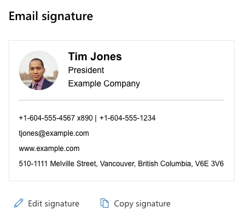

This web part allows users to copy their company's branded email signature and paste it into their email client. Includes an example of using [Testing Library](https://testing-library.com/) with the SharePoint Framework.

[Check out the repository on GitHub](https://github.com/habaneroconsulting/spfx-email-signature).
