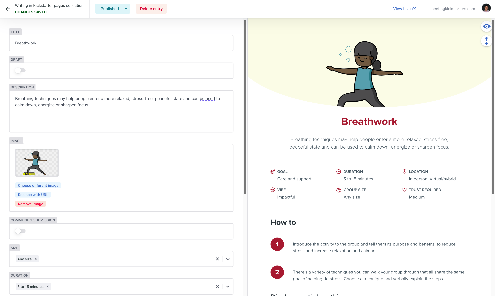
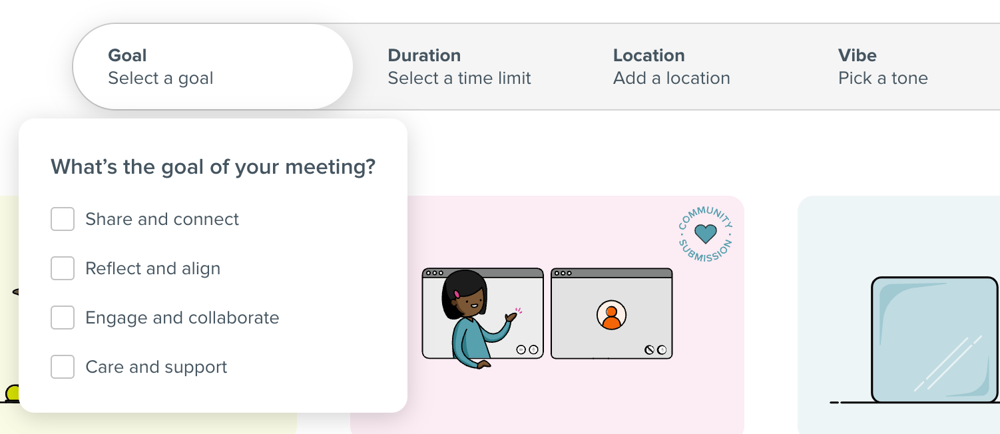

[MeetingKickstarters.com](https://meetingkickstarters.com/) is my first production Next.js site that we built as part of a end-of-year experience to send to customers at Habanero.

The site leverages:

- **Framework:** Next.js
- **CMS:** DecapCMS, connected to Azure DevOps
  - Connected to a Azure DevOps git repository
- **Hosting:** Azure Static Web Apps

## Azure Static Web Apps

Azure Static Web Apps have [mixed support](https://github.com/Azure/static-web-apps/discussions/1428) for Next.js 14 and the app directory. I wanted to get Next's standalone server working, but I ran into tons of different errors. Since we were using Azure DevOps and not GitHub, we had to use the SWA CLI, which may have been one of the sources of the issues. Hopefully this works in the future, as Azure Static Web Apps fit into our workplace's ecosystem well.

## DecapCMS

DecapCMS was an easy and free way to allow content authors to make simple changes to the site. Since we already leverage Azure DevOps, [integrating with it was simple](https://decapcms.org/docs/azure-backend/) and we got single-sign on for free. This feature is thousands of dollars with other platforms.

One pain with DecapCMS is that the live preview of the site within the tool requires using a client component. This prevents using server components within it, or in our case, using Node to dynamically get image dimensions.

## react-aria

I leveraged [`react-aria`](https://react-spectrum.adobe.com/react-aria) to handle all of our interactive components. This made it a lot easier to deal with the accessibility concerns that interactions can have.

## Image optimization

This site was built using Next's static site generation rendering mode. SSG does not have an image optimization solution, so we leveraged [`next-image-export-optimizer`](https://github.com/Niels-IO/next-image-export-optimizer). This tool is pretty great, but does not convert to AVIF yet.

---

Read more about the inspiration on [habaneroconsulting.com](https://www.habaneroconsulting.com/stories/insights/2024/habaneros-meeting-kickstarter-toolbox).
