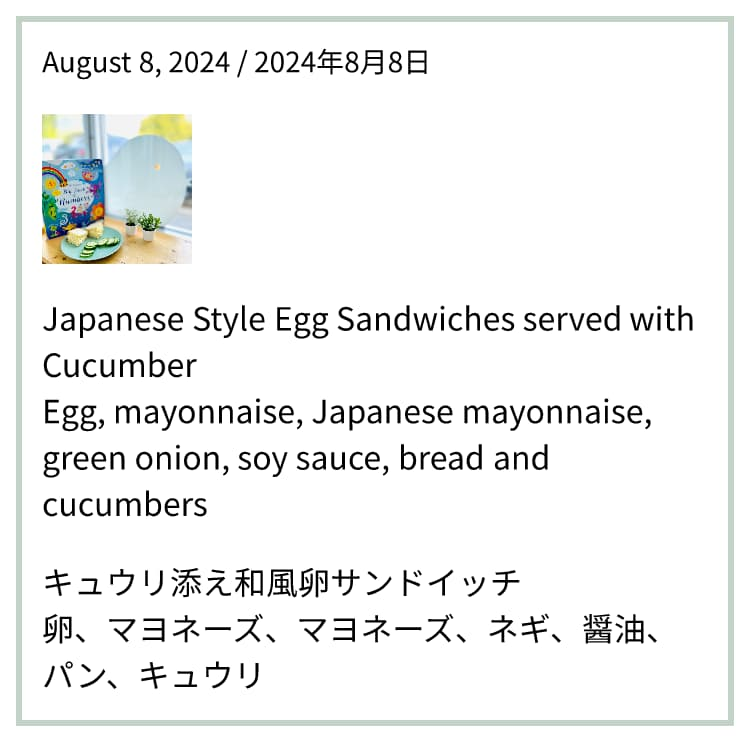

Open Graph images are used by messaging apps and social media sites to show a preview of the content of a page. Creating these graphics with dynamic metadata would be a chore to do manually, but luckily there are a lot of resources out there to build them.

## Satori

[Satori](https://github.com/vercel/satori) is a tool that takes JSX and converts it into an SVG. It doesn't support every CSS property unfortunately, but is an easy way for a front-end developer to make images.

[OG Image Playground](https://og-playground.vercel.app) is a supporting tool to help visualize and debug your image generation. On more complex images, I have found that flexing works correctly in the HTML view, but not in the actual generated SVG.

## Usage in Next.js

Satori is made by Vercel, so it's [easy to use within Next.js](https://nextjs.org/docs/app/building-your-application/optimizing/metadata#dynamic-image-generation) with the next/og library. However, if you're using the app router and statically generating your site (`output: export`), [you cannot dynamically generate images at build time](https://github.com/vercel/next.js/issues/51147). I ended up using the [following comment](https://github.com/vercel/next.js/issues/51147#issuecomment-1842197049) to get around the problem.

## Usage in Astro

There's nothing out-of-the-box to help generate images for Astro, but I did try a few plugins. [`astro-opengraph-images`](https://github.com/shepherdjerred/astro-opengraph-images) creates images by crawling your generated content and pulls out metadata from it. This didn't work in my use case, because my page titles have site suffixes on them and I didn't want this in the output.

### Resources

- [How I generate Open Graph images for my Astro-based blog](https://techsquidtv.com/blog/generating-open-graph-images-for-astro/)
- [Generating static Open Graph (OG) images in Astro using @vercel/og](https://www.kozhuhds.com/blog/generating-static-open-graph-og-images-in-astro-using-vercel-og/)
- [OG Image Generation with Astro](https://blog.otterlord.dev/posts/dynamic-opengraph/)

## Sharp vs resvg-js

For this blog, I thought that the generated PNG text could look sharper and thought it might be an issue with `sharp`. I tried switching over to `resvg-js`, but this made no difference.

## Open Graph example with Next.js

This comes from [meetingkickstarters.com](https://meetingkickstarters.com), where we dynamically generated an image for each kickstarter with it's illustration and title.


### Code

```typescript
/* eslint-disable @next/next/no-img-element */

import type { JSXElementConstructor, ReactElement } from 'react';
import { ImageResponse } from 'next/og';
import { readFileSync } from 'node:fs';
import path from 'node:path';

import { PageMetadata } from '@/types';
import { GOAL_COLOR_MAP_EXPORT } from '@/constants';

// Image metadata
export const alt = 'Meeting Kickstarters by Habanero Consulting Inc.';
export const size = {
  width: 1200,
  height: 630,
};

export const contentType = 'image/png';

// Image generation
export default async function Image({
  element,
  metadata,
}: {
  element?: ReactElement<any, string | JSXElementConstructor<any>>;
  metadata: PageMetadata;
}) {
  // Use CDN based woff file since resources need to be absolute.
  // Only woff (and not woff2) is supported.
  const ProximaNovaBold = await fetch(
    `https://cdn.habaneroconsulting.com/Content/Habanero/fonts/ProximaNova/ProximaNova-Bold.woff`
  ).then((res) => res.arrayBuffer());

  // Get the illustration and convert it to base64 to use within the image tag.
  const filePath = path.join('./public', metadata.imageSrc);
  const svgData = readFileSync(path.resolve(filePath));
  const base64Svg = svgData.toString('base64');
  const dataUri = `data:image/svg+xml;base64,${base64Svg}`;

  return new ImageResponse(
    element ? (
      element
    ) : (
      <div
        style={{
          backgroundColor: GOAL_COLOR_MAP_EXPORT[metadata.goal],
          display: 'flex',
          flexDirection: 'column',
          padding: 64,
          height: '630px',
          width: '1200px',
        }}
      >
        <div
          style={{
            display: 'flex',
            flexGrow: 1,
            overflow: 'hidden',
            width: '100%',
          }}
        >
          
        </div>
        <div
          style={{
            color: '#293339',
            display: 'flex',
            fontSize: 50,
            justifyContent: 'center',
            marginBlockStart: 32,
            textAlign: 'center',
          }}
        >
          {metadata.title}
        </div>
      </div>
    ),
    // ImageResponse options
    {
      ...size,
      fonts: [
        {
          name: 'Proxima Nova',
          data: ProximaNovaBold,
          style: 'normal',
          weight: 400,
        },
      ],
    }
  );
}
```

## Open Graph example with Astro


### Code

```typescript
import type { JSX } from 'astro/jsx-runtime';

import fs from 'fs/promises';
import satori from 'satori';
import sharp from 'sharp';

// @see https://og-playground.vercel.app/?share=VZHfS8MwEMf_lXAgU6hYdYqE6ctU9E2YsJe9pM2tzUyTkqTOWvq_m9sPuwYSct_73F0u10FuJQKHmVTfK8OYD63Gx66jOy2hVWHeA1aes8la48-lD8KFSXIEMpF_Fc42Rs6tti5SrsjOb-4Stt8XA5qfArfkPRwnjFS-1qI9FBt0sp6Vwzwoa6I35moqc-K3JryKSmkKXdjG5cgWwnj24eyYWqhf5Ox-OhKXqIoyRDlN__VaSKlMMWLLAze5TtOzIe-m8UGt23nMhIbcu59CIwdkq2Qoj4Ek9v3KPNHlDbW2CVtap-XKzK7iJKIOCdiamvXAO9hFA3-Iz4P9G4BPyZCYNQXwtdAeE8DKbtRnW9NEw3ZnxTzU4EuVoQQeXIN9AkFkkSip8JbKQv8H

export function OpenGraphImage({ title }: { title: string }) {
  return {
    type: 'div',
    props: {
      style: {
        alignItems: 'flex-start',
        backgroundColor: 'rgb(25, 25, 25)',
        color: 'rgb(235, 235, 235)',
        display: 'flex',
        flexDirection: 'column',
        fontFamily: 'Source Sans Pro',
        gap: 32,
        height: '100%',
        justifyContent: 'flex-end',
        padding: 64,
        width: '100%',
      },
      children: [
        {
          type: 'div',
          props: {
            style: {
              fontSize: 32,
              fontWeight: 600,
            },
            children: 'cwparsons.ca/TIL',
          },
        },
        {
          type: 'div',
          props: {
            style: {
              fontSize: 88,
              fontWeight: 600,
            },
            children: title,
          },
        },
      ],
    },
  };
}

export async function SVG(component: JSX.Element) {
  return await satori(component, {
    width: 1200,
    height: 630,
    fonts: [
      {
        name: 'Source Sans Pro',
        weight: 400,
        style: 'normal',
        data: await fs.readFile(
          './node_modules/@fontsource/source-sans-pro/files/source-sans-pro-latin-400-normal.woff',
        ),
      },
      {
        name: 'Source Sans Pro',
        weight: 600,
        style: 'normal',
        data: await fs.readFile(
          './node_modules/@fontsource/source-sans-pro/files/source-sans-pro-latin-600-normal.woff',
        ),
      },
    ],
  });
}

export async function PNG(title: string) {
  const svg = await SVG(OpenGraphImage({ title }));

  return sharp(Buffer.from(svg)).png().toBuffer();
}
```

## Non-Open Graph example

This is another example of an dynamically generated image, using other images and translated content as a source. This takes in content from another app to get automatically posted in a Google Photos album.

This uses [`resvg-js`](https://github.com/yisibl/resvg-js) to generate the image nad



### Code

```typescript
import { readFile } from "node:fs/promises";
import React from "react";
import satori from "satori";
import { Resvg } from "@resvg/resvg-js";

import { ImagePool } from "@squoosh/lib";
import { cpus } from "os";
const imagePool = new ImagePool(cpus().length);

export async function generateImage(
  date: string,
  description: string,
  images?: string[]
) {
  const _images = images;

  // Pad images to be a multiple of four. This helps align the images later.
  if (_images) {
    for (let i = _images.length; i % 4 !== 0; i++) {
      _images.push('');
    }
  }

  const fontArrayBuf = await readFile(
    "./src/public/fonts/Noto-Sans-JP-regular.woff"
  );
  const emojiFontArrayBuffer = await readFile(
    "./src/public/fonts/Noto-Sans-Emoji-regular.woff"
  );

  const translation = await fetch(...);

  const { data } = await translation.json();
  const ja = data.translations[0].translatedText;

  const Flex = ({
    style,
    ...props
  }: React.DetailedHTMLProps<
    React.HTMLAttributes<HTMLDivElement>,
    HTMLDivElement
  >) => <div style={{ display: "flex", ...style }} {...props} />;

  const svg = await satori(
    <Flex
      style={{
        backgroundColor: "white",
        padding: "8px",
        width: "100%",
      }}
    >
      <Flex
        style={{
          border: "3px solid #c2d2c7",
          flexDirection: "column",
          gap: "16px",
          color: "black",
          padding: "10px",
          width: "100%",
        }}
      >
        <Flex style={{ fontSize: "14px" }}>{date}</Flex>

        {_images && (
          <Flex
            style={{
              justifyContent: "space-between",
              flexWrap: "wrap",
              gap: "10px",
            }}
          >
            {_images.map((image, i) => (
              <Flex key={i} style={{ width: 75, height: 75 }}>
                {image !== "" && (
                  
                )}
              </Flex>
            ))}
          </Flex>
        )}
        <Flex style={{ whiteSpace: "pre-wrap" }}>{description}</Flex>
        <Flex
          style={{
            whiteSpace: "pre-wrap",
          }}
          lang="ja-JP"
        >
          {ja.replace(/<br \/>/g, "\n")}
        </Flex>
      </Flex>
    </Flex>,
    {
      width: 375,
      fonts: [
        {
          name: "Noto Sans JP",
          data: fontArrayBuf,
          weight: 400,
          style: "normal",
        },
        {
          name: "Noto Emoji",
          data: emojiFontArrayBuffer,
          weight: 400,
          style: "normal",
        },
      ],
    }
  );

  const resvg = new Resvg(svg, {
    background: "rgb(255, 255, 255)",
    fitTo: {
      mode: "width",
      value: 375 * 2,
    },
  });
  const pngData = resvg.render();
  const pngBuffer = pngData.asPng();

  const image = imagePool.ingestImage(pngBuffer);

  const result = await image.encode({ mozjpeg: {} });

  return result.mozjpeg.binary;
}
```
