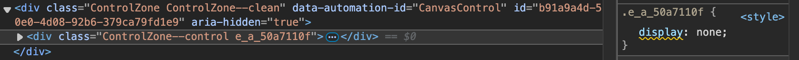

import { Image } from 'astro:assets';
import screenshot from './1.png';

In some first-party web parts, like the _Highlighted content_ web part, you can hide the web part if there's nothing to show:

<Image
  alt="Screenshot of the highlighted content web part in SharePoint"
  height={788 / 2}
  src={screenshot}
/>

This not only hides the contents of the web part but also sets the `.ControlZone` to `[aria-hidden="true"]` and the inner `.ControlZone--control` to be `display: none`.



For [PnP Modern Search](https://github.com/microsoft-search/pnp-modern-search/blob/c68ee02cc2d2a9b93fe4eb5b78f00ba09e3045c3/search-parts/src/webparts/searchResults/SearchResultsWebPart.ts#L470-L482), they accomplish this by manually removing the margins and padding from ancestor elements:

```typescript
if (this.properties.showBlankIfNoResult) {
  let element = this.domElement.parentElement;
  // check up to 3 levels up for padding and exit once found
  for (let i = 0; i < 3; i++) {
    const style = window.getComputedStyle(element);
    const hasPadding = style.paddingTop !== '0px';
    if (hasPadding) {
      element.style.paddingTop = '0px';
      element.style.paddingBottom = '0px';
      element.style.marginTop = '0px';
      element.style.marginBottom = '0px';
    }
    element = element.parentElement;
  }
}
```

However, there is an **unsupported** way to hide a web part like the first-party ones can. There is a private property on `BaseClientSideWebPart` called [`isVisible`](https://unpkg.com/browse/@microsoft/sp-webpart-base@1.19.0/dist/index-internal.d.ts). Setting this to `false` will hide the web part.

```typescript
export default class CredentialsWebPart extends BaseClientSideWebPart<CredentialsWebPartProps> {
  public render(): void {
    if (shouldHide) {
      //@ts-expect-error `isVisible` is a private property.
      this._isVisible = false;
    }
  }
}
```
