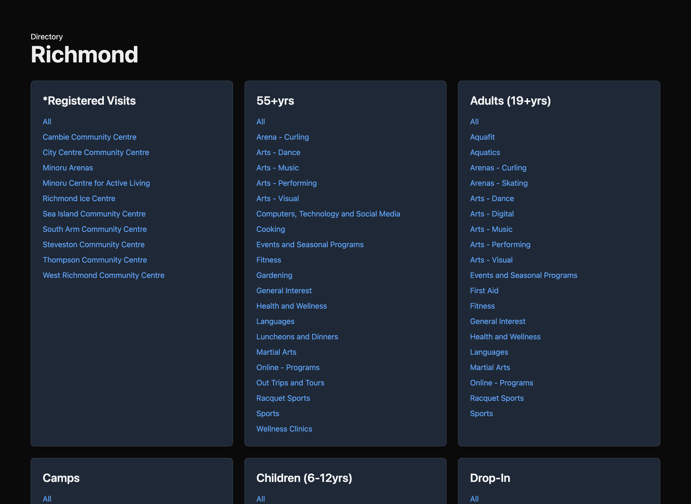
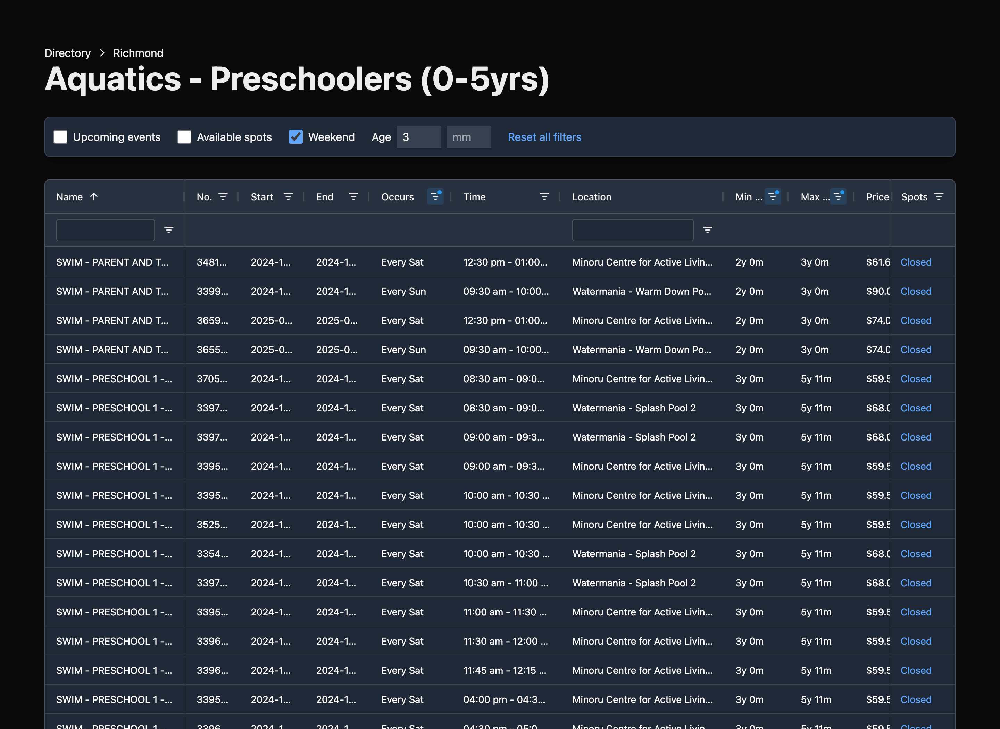

The [Recreational viewer](https://recreational-viewer.vercel.app/city/richmondcity) is an alternative front-end to the [City of Richmond activities site](https://richmondcity.perfectmind.com/). It also supports a number of other sites that use similar software. The site is built with Next.js and hosted on Vercel.

When using the filtering on the normal site, the filters get unselected every time you switch between category. This tool saves the filters in local storage.

Check out the [repository on GitHub](https://github.com/cwparsons/recreational-viewer).
