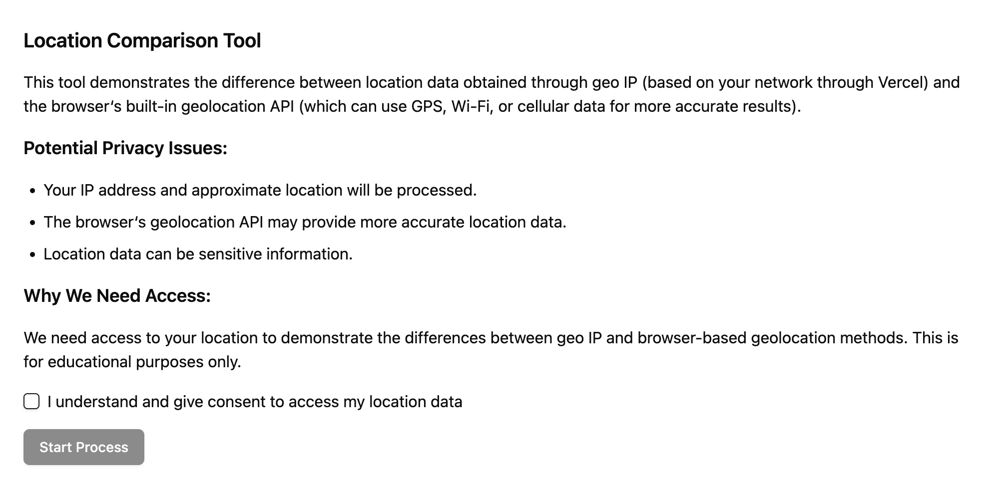

On some projects, we use IP address lookup to personalize content. However, we've
been curious how well this works on mobile networks. To help test this, I got
[v0.dev](https://v0.dev/chat/c2JFn44z3LG?b=b_3GYXdeIV92Z) to build out a page
that compares the IP address lookup (through Vercel) versus what the device GPS
spits out.

[Try the experiment](https://geoip-nextjs-experiment.vercel.app/).

Check out the [GitHub repository](https://github.com/cwparsons/geoip-nextjs-experiment).
