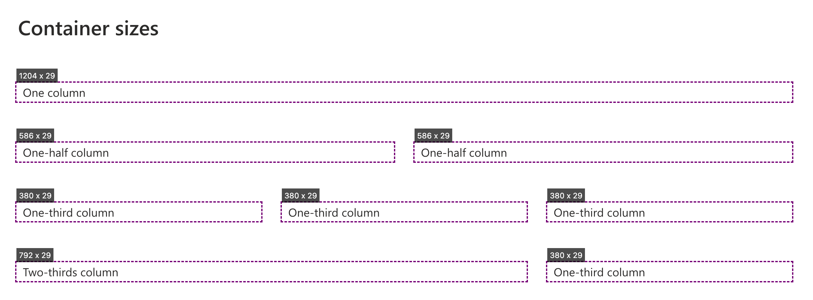

This bookmarklet outlines containers and shows their size to help test designs. Has some additional functionality for scrolling within modern SharePoint pages. Drag the following link to your bookmark bar.

<a href="javascript:(function()%7Bjavascript%3A(()%20%3D%3E%20%7B%0A%2F%2F%20Style%20for%20the%20outlines%20and%20size%20display%0Aconst%20style%20%3D%20document.createElement('style')%3B%0Astyle.textContent%20%3D%20%60%0A.container-outline%20%7B%0Aoutline%3A%202px%20dashed%20purple%3B%0Apointer-events%3A%20none%3B%0Aposition%3A%20fixed%3B%0Az-index%3A%2010000%3B%0A%7D%0A%0A.container-outline-label%20%7B%0Abackground%3A%20rgba(0%2C%200%2C%200%2C%200.7)%3B%0Acolor%3A%20white%3B%0Afont-family%3A%20var(--fontFamilyBase%2C%20system-ui)%3B%0Afont-size%3A%200.75rem%3B%0Apadding%3A%200.25rem%3B%0Aposition%3A%20absolute%3B%0Atransform%3A%20translateY(-100%25)%3B%0A%7D%0A%60%3B%0Adocument.head.appendChild(style)%3B%0A%0A%2F%2F%20Function%20to%20create%20outlines%0Aconst%20updateOutlines%20%3D%20()%20%3D%3E%20%7B%0A%2F%2F%20Remove%20existing%20outlines%0Adocument.querySelectorAll('.container-outline').forEach((el)%20%3D%3E%20el.remove())%3B%0A%0A%2F%2F%20Create%20outlines%20for%20each%20container%20element%0Adocument.querySelectorAll('body%20*%3Anot(script)%3Anot(link)').forEach((el)%20%3D%3E%20%7B%0Aconst%20%7B%20containerType%20%7D%20%3D%20getComputedStyle(el)%3B%0A%0Aif%20(containerType%20%3D%3D%3D%20'normal')%20return%3B%0A%0Aconst%20rect%20%3D%20el.getBoundingClientRect()%3B%0A%0Aconst%20outline%20%3D%20document.createElement('div')%3B%0Aoutline.className%20%3D%20'container-outline'%3B%0Aoutline.style.left%20%3D%20%60%24%7Brect.left%7Dpx%60%3B%0Aoutline.style.top%20%3D%20%60%24%7Brect.top%7Dpx%60%3B%0Aoutline.style.width%20%3D%20%60%24%7Brect.width%7Dpx%60%3B%0Aoutline.style.height%20%3D%20%60%24%7Brect.height%7Dpx%60%3B%0A%0Aconst%20label%20%3D%20document.createElement('div')%3B%0Alabel.className%20%3D%20'container-outline-label'%3B%0Alabel.textContent%20%3D%20%60%24%7BMath.round(rect.width)%7D%20x%20%24%7BMath.round(rect.height)%7D%60%3B%0Aoutline.appendChild(label)%3B%0A%0Adocument.body.appendChild(outline)%3B%0A%7D)%3B%0A%7D%3B%0A%0AupdateOutlines()%3B%0A%0Awindow.addEventListener('resize'%2C%20updateOutlines)%3B%0Awindow.addEventListener('scroll'%2C%20updateOutlines)%3B%0Adocument%0A.querySelector('%5Bdata-automation-id%3D%22contentScrollRegion%22%5D')%0A.addEventListener('scroll'%2C%20updateOutlines)%3B%0A%7D)()%3B%7D)()%3B">View container sizes</a>



```javascript
javascript:(() => {
    const style = document.createElement('style');
    style.textContent = `
        .container-outline {
            outline: 2px dashed purple;
            pointer-events: none;
            position: fixed;
            z-index: 10000;
        }

        .container-outline-label {
            background: rgba(0, 0, 0, 0.7);
            color: white;
            font-family: var(--fontFamilyBase, system-ui);
            font-size: 0.75rem;
            padding: 0.25rem;
            position: absolute;
            transform: translateY(-100%);
        }
    `;
    document.head.appendChild(style);

    const updateOutlines = () => {
        document.querySelectorAll('.container-outline').forEach((el) => el.remove());

        document.querySelectorAll('body *:not(script):not(link)').forEach((el) => {
            const { containerType } = getComputedStyle(el);

            if (containerType === 'normal') return;

            const rect = el.getBoundingClientRect();

            const outline = document.createElement('div');
            outline.className = 'container-outline';
            outline.style.left = `${rect.left}px`;
            outline.style.top = `${rect.top}px`;
            outline.style.width = `${rect.width}px`;
            outline.style.height = `${rect.height}px`;

            const label = document.createElement('div');
            label.className = 'container-outline-label';
            label.textContent = `${Math.round(rect.width)} x ${Math.round(rect.height)}`;
            outline.appendChild(label);

            document.body.appendChild(outline);
        });
    };

    updateOutlines();

    window.addEventListener('resize', updateOutlines);
    window.addEventListener('scroll', updateOutlines);
    document
        .querySelector('[data-automation-id="contentScrollRegion"]')
        .addEventListener('scroll', updateOutlines);
})();
```
