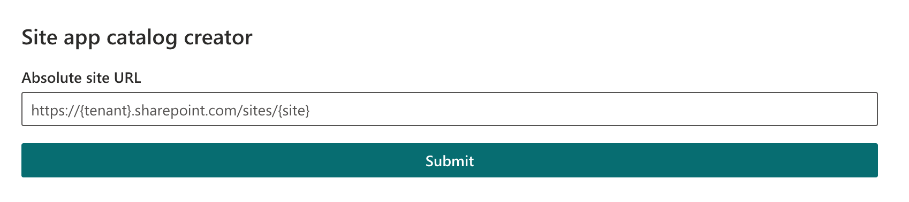

Normally to create a site collection app catalog, this needs to be accomplished using PowerShell via `Add-SPOSiteCollectionAppCatalog` or `Add-PnPSiteCollectionAppCatalog`.
However, if you're creating a lot of sites constantly using the UI, it can be a bit of a pain to login to PowerShell just to create the app catalog. This is where this web part comes in:

[Check out spfx-site-collection-app-catalog on GitHub](https://github.com/cwparsons/spfx-site-collection-app-catalog).



To use it, you need to use the workbench to load the web part. The web part can be installed in the tenant app catalog, or a site collection app catalog can be created for the admin site.

Behind the scenes, it sends the following XML to create the site:

```xml
<Request
  AddExpandoFieldTypeSuffix="true"
  SchemaVersion="15.0.0.0"
  LibraryVersion="16.0.0.0"
  ApplicationName="GO Development Tools"
  xmlns="http://schemas.microsoft.com/sharepoint/clientquery/2009"
>
  <Actions>
    <ObjectPath Id="38" ObjectPathId="37" />
    <ObjectPath Id="40" ObjectPathId="39" />
    <ObjectPath Id="42" ObjectPathId="41" />
    <ObjectPath Id="44" ObjectPathId="43" />
    <ObjectPath Id="46" ObjectPathId="45" />
    <ObjectPath Id="48" ObjectPathId="47" />
  </Actions>
  <ObjectPaths>
    <Constructor Id="37" TypeId="{268004ae-ef6b-4e9b-8425-127220d84719}" />
    <Method Id="39" ParentId="37" Name="GetSiteByUrl">
      <Parameters>
        <Parameter Type="String">https://contoso.sharepoint.com/sites/example</Parameter>
      </Parameters>
    </Method>
    <Property Id="41" ParentId="39" Name="RootWeb" />
    <Property Id="43" ParentId="41" Name="TenantAppCatalog" />
    <Property Id="45" ParentId="43" Name="SiteCollectionAppCatalogsSites" />
    <Method Id="47" ParentId="45" Name="Add">
      <Parameters>
        <Parameter Type="String">https://contoso.sharepoint.com/sites/example</Parameter>
      </Parameters>
    </Method>
  </ObjectPaths>
</Request>
```

This approach to installing web parts to the admin site is not recommended for production tenants.
